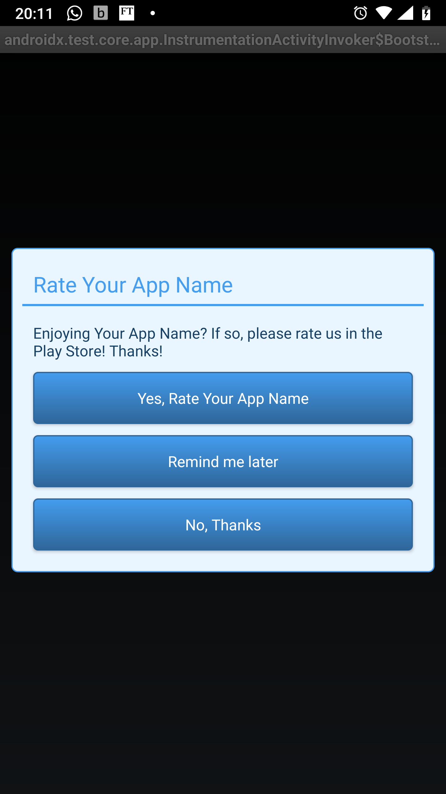
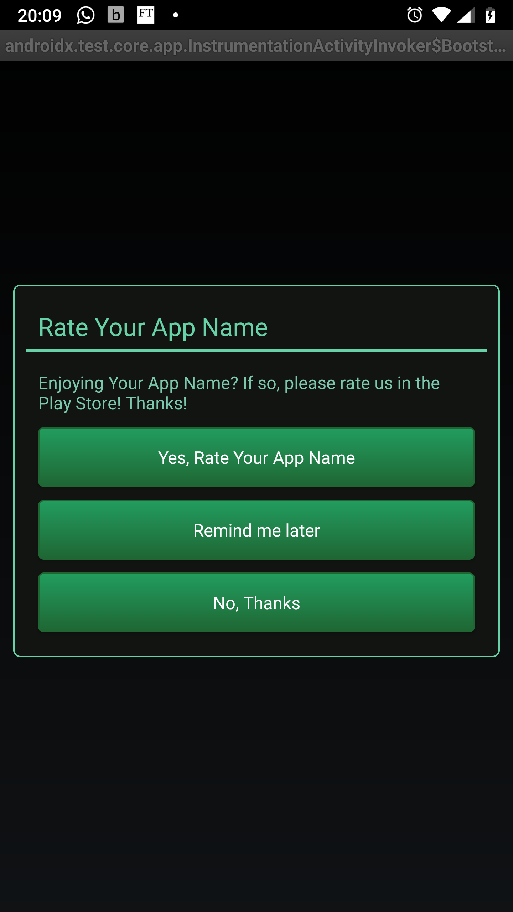

# Introduction

A simple to integrate and easy to use application rater for Android apps.

# How it works

A dialog will prompt the user to rate the app on the app store. When the user:
 - chooses *Yes*, he is sent to the app store
 - chooses *Later*, he is reminded again later
 - chooses *No* he won't be bothered again
 
# How it looks like

| Default Theme                                | Customised Theme                            |
-----------------------------------------------|----------------------------------------------
|  |  |

# Set up

## As a compiled library
1. Download the `appirater-android-release.aar` and place it in your libs e.g. `app/libs/appirater-android-release.aar`
2. In your `app/build.gradle` add the module as a dependency:

        dependencies {
            [...]
            dependencies {
                implementation files('libs/appirater-android-release.aar')
            [...]
        }

## As a sub-module
1. Check check out the project as a module in your project, e.g. in directory `appirater-android`
2. In your `app/build.gradle` add the module as a dependency:

        dependencies {
            [...]
            dependencies {
                implementation project(':appirater-android')
            [...]
        }

# Customization
:warning: At a minimum modify `appirater_app_title` to read the title of your app.

## Settings
-----------------------
You can change any of these values below by re-defining it in a `values` XML file.

You can copy the `res/values/appirater-settings.xml` in to your project's `/res/values/` folder and adjust the settings to your preference.

These are all the settings that can be configured via the XML file:
 - `appirater_app_title`: your app name
 - `appirater_market_url`: URL of your app store (default: Google Play)
   - Google Play App Store = `market://details?id=%s`
   - Amazon App Store = `http://www.amazon.com/gp/mas/dl/android?p=%s
 - `appirater_days_until_prompt`: minimum days from initioal launch until prompt to rate (default: 30)
 - `appirater_launches_until_prompt`: minimum launches until it prompts to rate (default: 15)
 - `appirater_untimed_events_until_prompt`: minumum events until it prompts to rate, regardless of time since launch (default: 15)
 - `appirater_timed_events_until_prompt`: minimum events until it prompts to rate, but only after the minimum days has passed (default: 15)
 - `appirater_days_before_reminding`: if user chose *Later*, minimum days before it prompts to rate again (default: 3)
 - `appirater_test_mode`: set this to *true* for testing the dialog at every launch (default: false)
 
## Colors
---------
You can change any of those values below by re-defining it in a `colors` XML file.
 - `appirater_button_start_color`: gradient start color for buttons
 - `appirater_button_end_color`: gradient end color for buttons
 - `appirater_button_text_color`: button text color
 - `appirater_title_color`: title, divider and contour color
 - `appirater_message_color`: text message color
 - `appirater_background_color`: the background color of the whole dialog

License
-------------------------
MIT/X11: http://opensource.org/licenses/MIT

This is originally forked from:
    https://github.com/kenyee/appirater-android
...which is a modified version of:
    https://github.com/drewjw81/appirater-android/

